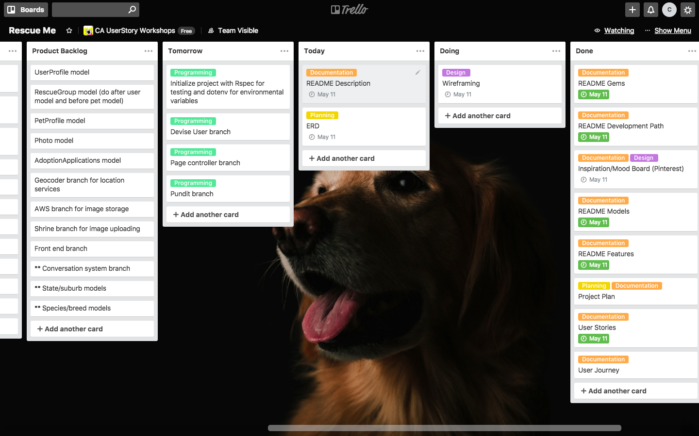

# Rescue Me

## [Rescue Me - hosted on Heroku](https://rescueme-app.herokuapp.com/)
#### [Github link](https://github.com/cameocodes/rescue-me)
#### [Presentation Link](https://docs.google.com/presentation/d/112lZUyc7dhP9sp3RSCZx_xozdgEQwxPssgEituydl5E/edit?usp=sharing)

- [Description](#description)
    - [The Problem](#the-problem)
    - [The Solution](#the-solution)
- [Development Plan](#development-plan)
- [Trello Board](#trello-board)
- [User Stories](#user-stories)
- [User Journeys](#user-journeys)
- [Entity Relationship Diagram](#entity-relationship-diagram)
- [Mood Board and Inspiration](#mood-board-and-inspiration)
- [Wireframes](#wireframes)
- [Features](#features)
- [Gems Used](#gems-used)
- [Challenges](#challenges)
- [Coding](#coding)
- [Code Reviews](#code-reviews)
- [Roadmap](#roadmap)
- [How To Install](#how-to-install)

---

## Description
### The Problem
Thousands of pets that enter the pound system every year are euthanised due to space constraints. Rescues organisations can be disjointed with poor websites, no social media skills which makes it harder for potential owners to find their next best friend.

Owners who can no longer look after their dog, who have inherited a pet from a deceased family member, or due to a change in circumstances can no longer have a pet struggle to find rescues that are willing to take surrendered animals. This means even more pets are put into the pound system.

### The Solution
**Rescue Me** is a platform for pounds, shelters and rescue organisations to advertise their pets in a centeralised location, giving the public an easier way to find pets available for adoption. It allows the public to advertise pets that they can no longer care for in a space where any registered rescue organisations can see them. 

**Rescue Me** streamlines what is often a complicated and confusing adoption process - applications to adopt a pet can be submitted, reviewed and approved all within the website.

---
## Development Plan
### Monday 30th - Thursday 3rd
- README
- User Stories
- Trello
- Mood Board
- Wireframes/Figma
### Friday 4th
- Devise
- Profile model
- Pet model
### Saturday 5 (working today)
- Geocoder
### Sunday 6
- Geocoder
- Shrine
### Monday 7
- AWS
- Shrine
- Stripe
### Monday 7
- Stripe
- Front End
### Tuesday 8
- Front End
### Wednesday 9
- Deploy and fix Heroku issues
### Thursday 10
- Fix everything that is broken
- Finish documentation and presentation
### Friday 11
- Presentation

---
## Trello Board
### [Trello Board](https://trello.com/b/8GPSQEcI)
Trello was an invaluable tool to organise my thoughts and form a cohesive plan for the development of my site. I started with lists like 'Brainstorming', 'Features' and 'Technical Requirements' which I was then able to break down into more specific topics once I knew where I was headed. I used labels to batch my tasks together and make it easier to complete several similar tasks at once. The final Trello setup that I used during the development of the site looked like this:

---
## User Stories
#### Rescue Group
1. As a rescue, I want to be able to see a list of animals available to be surrendered near me so that I can take on new animals.
2. As a rescue, I want see a list of the animals we have advertised on the website so that I know which animals we have already listed.
3. As a rescue, I want to be able to contact users to take on surrenders.
4. As a rescue, I want to be able to message potential adoptees through the website to streamline the adoption process.
5. As a rescue, I want to be able to see all users that have previously applied for one of my pets so that I can see if they already have one of our animals or if they were declined for a certain reason.
6. As a rescue, I want to be able to advertise pets in a streamlined process so that it is as simple as possible.
7. As a rescue, I want to receive alerts when a type of animal I have flagged (specific species/breed/age) have become available for surrender so that I can contact their owner.
8. As a rescue, I want to be able to blacklist users and ban all future communication from them so that they can't harass me.
9. As a rescue, I want to advertise if I am looking for foster carers or taking on surrender animals so that the public is aware.
10. As a rescue, I want to advertise on a site-wide rescue directory so users can find my rescue.
11. As a rescue, I want to be able to message other rescues so that we can discuss applicants, issues we're having etc.
12. As a rescue, I want to be able to flag users for being abuse or rude so that other rescues can see it.
13. As a rescue, I want to receive donations from the public through the website.

#### User / Adoptee 
1. As a user, I want to be able to advertise my pet for surrender to a rescue so that I know they will be cared for.
2. As a user, I want to be able to see a list of animals that I've applied for or surrendered.
3. As a user, I want to click on a specific rescue and see if they are acception surrendered animals so I can contact them directly.
4. As a user, I want to receive an email when a specific type of animal (species/breed/age) becomes available for adoption.
5. As a user, I want to see a list of rescues in my state that are accepting surrender animals so that I can contact them.
6. As a user, I want to click on a specific rescue and see if they require foster carers so that I can apply to be one.
7. As a user, I want to see a list of rescues that require foster carers so that I can contact them directly.
8. As a user, I want to contact rescues through the website so that they can answer my questions about an animal.
9. As a user I want to apply for an animal though the website so that it is a streamlined process.
10. As a user, I want to dontate directly to a rescue through the website.

#### Guest
1. As a potential pet owner, I want to see the kind of pets available for adoption without logging in so that I don't have to make an account unless I want to adopt one.
2. As an animal lover, I want to easily share posts from this website to Facebook so that my friends can see animals available for adoption.

#### Market Owner/Admin
1. As admin, I want to be able to approve rescues so that only legitimate incorporated rescues can advertise animals for adoption.
2. As admin, I want to be able to send out emails to rescues and to users so that I can let them know about upcoming events, website changes etc.
3. As market owner, I need a way for the website to be profitable so that I am not spending my own money to keep the website alive.
4. As admin, I want to be able to delete users and rescues if they violate our terms and conditions.

---
## User Journeys

---
## Entity Relationship Diagram
My initial ERD was very detailed and had what felt like a million tables. Once I started making the app however, I realised that I had overestimated my abilities. My huge ERD ended up scaled down to three essential tables.
### Original ERD

### Current ERD

---
## Mood Board and Inspiration
### [Pinterest Board](https://www.pinterest.com.au/hello9327/rails-site-inspo/)
Initially I wanted to have a nice clean, crisp design similar to the Google Material Design style so it features heavily in my Pinterest board.

---
## Wireframes
### [Figma](https://www.figma.com/file/D6zxse7wpLjgmB893NXtTWNs/Rescue-Website?node-id=48%3A16)
I decided I wanted to use a grey-based theme with orange as a feature colour. I made a horrible theme that strongly featured a bright orange colour and - after getting some very blunt feedback - spent a day seriously considered quitting the course. With some guidance from Babs I settled on a light grey theme with a light purple as a feature colour. Material Design just didn't seem to work for me so I settled on a basic flat UI look and ended up being pretty happy with my final design.

I took a lot longer to finish my Figma designs than I had planned, mostly due to the fact that I wanted to have a design for every page of app. In hindsight, this wasn't entirely necessary.

---
## Features
- Advertise pets available for adoption as a rescue organisation
- Apply to adopt a pet that is listed
- Advertise a pet that you can no longer care for (surrender)
- Search listings by state, breed, size, age etc.
- Search for rescue organisations by name, state, species rescued etc.
- View all registered rescues in a list
- Register your rescue organisation to allow you to post pets available for adoption
- Messaging between users and rescue organisations
- Donation button for rescues

---
## Gems Used
- Rspec (testing)
- Devise (authenitcation)
- Pundit (authorization)
- Geocoder (geolocation - distance queries)
- Shrine (image uploading)
- AWS (image storage)
- Stripe (payment processing)
- Dotenv (environmental variables)
- Mailgun-ruby (email service)
- Mini_magick (image manipulation)
- Pry (troubleshooting)
- Social-share-button (social media sharing)

---
## Challenges
- I struggled deciding on the initial look of the site. I hated everything I made, even though I had plenty of inspiration and knew the exact look I wanted.
- Understanding all of the relationships between tables when making the ERD.
- Deciding to not use a logo - I designed some pretty horrible ones before I realised I didn't really need one.
- I spent about a day trying to get Stripe working. It still isn't fully implemented.
- AWS cancelled my access key due to *unauthorized access*, a.k.a me trying to use it.
- **Update:** I was an absolute potato and broke the cardinal rule - I forgot to add my .env files to the .gitignore and my S3 secret key ended up on the internet. That's why AWS was blocking my access. After a hectic hour on the train to class on presentation day trying to get it sorted out I managed to get my app functional an hour before I had to submit.

---
## Coding
When I first started coding, I tried to implement as many features as possible all at once. I realised after two days that I had bitten off more than I could chew, and with 5 days until the assessment was due I completely restarted it.

Although it was a stressful time, one of the highlights of the project weeks was being able to help troubleshoot other students' problems and having them assist me in turn. 

---
## Code Reviews
I had quite a few people assist with my code, reviewing and suggesting changes regularly. Many thanks especially to Drew, Maxi and Gen for helping me get over some tough hurdles. A fresh set of eyes makes all the difference when you've been staring at a problem for an hour.

---
## Roadmap
Features that I plan to implement in the future include:
- State/suburb models with drop down form selectors to prevent user error when entering addresses
- Species/breed models for the same reason above
- A conversation/messaging system
- OAuth login
- Email alerts for when favourited breeds/species appear
- Pagination for listing pets
- Admin panel for approving adoption applications

---
## How To Install